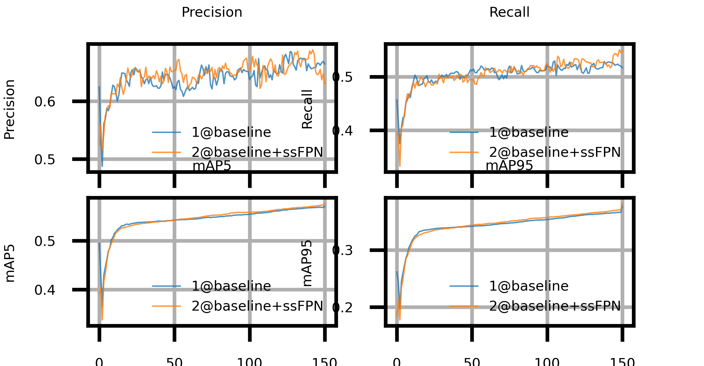

# ssFPN: Scale Sequence (S^2) Feature Based-Feature Pyramid Network for Object Detection

by Hye-Jin Park, Young-Ju Choi, Young-Woon Lee, Byung-Gyu Kim

This is an unofficial implementation of [“ssFPN: Scale Sequence (S^2) Feature Based-Feature Pyramid Network for Object Detection](https://arxiv.org/abs/2208.11533v2)”

The implementation was only trained and tested on my private dataset due to resource and time issues

My private dataset contains 8w images taken with real-world 1080P cameras, totaling 26 categories.  
PS: MultiScale Training is not used on ssFPN because of training memory issues.

| Model                           | pre-train  | epochs | mAP.5 | mAP.5:.95 |
| ------------------------------- | ---------- | ------ | ----- | --------- |
| Baseline(YoloV5 6.0)            | yolov5s.pt | 150    | 0.901 | 0.655     |
| Baseline + SpaceToDepth         | yolov5s.pt | 150    | 0.901 | 0.657     |
| Baseline + SpaceToDepth + ssFPN | yolov5s.pt | 150    | 0.909 | 0.674     |

| Model                           | resolution ratio | GPU   | FP16 latency(ms) |
| ------------------------------- | ---------------- | ----- | ---------------- |
| Baseline(YoloV5 6.0)            | 384x640          | MX450 | 15-21            |
| Baseline + SpaceToDepth         | 384x640          | MX450 | 15-18            |
| Baseline + SpaceToDepth + ssFPN | 384x640          | MX450 | 27-30            |

**Special thanks to [w13ww](https://github.com/w13ww) for providing the coco2017 test results**

| Model                | pre-train  | epochs | mAP.5         | mAP.5:.95     | AP Small      | AP Medium     | AP Large      |
| -------------------- | ---------- | ------ | ------------- | ------------- | ------------- | ------------- | ------------- |
| Baseline(YoloV5 6.0) | yolov5s.pt | 150    | 0.574         | 0.376         | 0.217         | 0.423         | 0.492         |
| Baseline + ssFPN     | yolov5s.pt | 150    | 0.579(↑0.005) | 0.380(↑0.004) | 0.234(↑0.017) | 0.430(↑0.007) | 0.478(↓0.014) |

| Model                | GPU  | FP16 latency(ms) |
| -------------------- | ---- | ---------------- |
| Baseline(YoloV5 6.0) | A100 | 0.9              |
| Baseline + ssFPN     | A100 | 1.3              |

